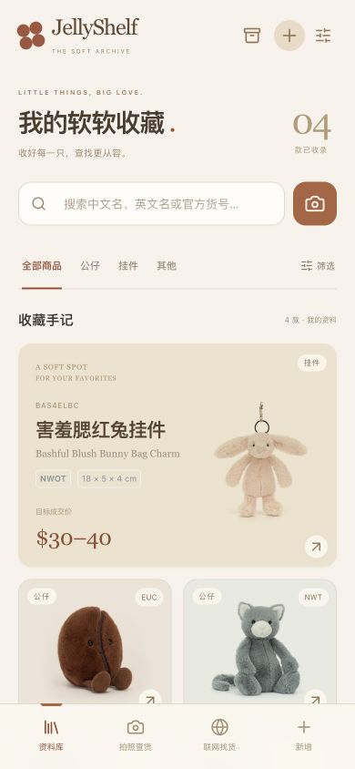

# JellyShelf · 我的软软收藏

用于直播查货的 Jellycat 商品资料库。采用奶油色移动界面，支持按名称、货号或照片查找自己录入的商品。

计划发布至 [violetloveAI.github.io/jellyshelf](https://violetloveAI.github.io/jellyshelf/)。**当前链接待实际发布验证。** 网站无需登录。商品资料和上传的照片保存在当前浏览器的 IndexedDB 中，不支持云同步。



截图来自本地运行版本；品相和目标价为界面测试输入，不代表市场行情。

## 本地运行

需要 Node.js 22.13 或更新版本，以及 npm。在项目目录执行：

```bash
npm ci
npm run dev
```

打开终端显示的地址，默认是 `http://127.0.0.1:5176`。

```bash
npm test
npm run build
npm run preview
```

`build` 先检查 TypeScript 类型，再生成 `dist/`。`preview` 用于本地检查构建结果。

## 开始使用

1. 选择「录入商品」，填写名称、照片、官方货号，以及尺寸、品相和目标价。无法核实的官方资料留白。
2. 直播时按中文名、英文名或货号搜索，也可拍照查找库内相似商品。点开商品，选择对应尺寸与品相。
3. 录入完成后，打开「数据与备份」导出 JSON；换设备时在同一入口选择备份，核对预览后导入。

iPhone 可在 Safari 的分享菜单选择「添加到主屏幕」。若系统提供「作为网页 App 打开」，可一并启用；这是网页应用，不需要 TestFlight。[Apple 操作说明](https://support.apple.com/guide/iphone/bookmark-a-website-iph42ab2f3a7/ios)

首次打开网站、加载照片匹配模型和查看官网图片时需要联网。当前没有离线缓存服务，不保证断网后能重新打开页面。

## 已支持的功能

| 功能 | 当前行为 |
| --- | --- |
| 商品资料 | 中英文名、照片、官方货号、尺寸、发售时间、美国首发官方定价、官方状态，以及备注与来源 |
| 尺寸与品相 | 同款可记录多个分支，分别填写 NWT、NWOT、EUC、GUC、UC、拿货价和目标价区间 |
| 快速查货 | 名称与货号搜索，分类、品相、官方状态筛选 |
| 照片查货 | 使用本机模型比对已录入照片，返回相似候选；仍需人工核对货号、尺寸与品相 |
| 成本 | 根据拿货价、固定运费和目标成交价计算成本区间 |
| 成交行情 | 手动录入已核验成交，分别展示 eBay、Whatnot 中位数及综合中位数 |
| 备份 | JSON 保存商品资料、成交记录和本机上传照片；确认后合并导入 |

新浏览器的商品库从空白开始。网站附带四款官方参考样例，核对并保存后才会加入你的商品库。样例中的当前官网价格不会自动填入「美国首发官方定价」。

## 成本与建议零售价

全部金额使用美元。每个分支的计算方式为：

```text
成本 = 拿货价 + 4 美元运费 + 成交价 × (11% 平台扣点 + 5% 人工)
```

成交前用目标价区间的上下限分别估算。例如拿货价 `$10`、目标价 `$20–30`，预计成本为 `$17.20–18.80`。这组数值只是计算示例，不会写入商品库。

行情默认统计近 90 天的美国市场成交，以美元计价。仅纳入同官方货号、同尺寸、同品相的单件实际成交价，不含运费和税。数据来自你人工核验后保存的记录。综合中位数将两平台的合格成交样本合并计算；少于 5 笔时提示参考不足，没有样本时留白。

## 资料保存在本机

应用不会将录入的资料或上传的照片发送到服务器。网站程序公开，每台设备、每个浏览器各自保存商品库。查看官网图片或打开外部资料链接时，浏览器会连接对应网站。

完整 JSON 备份包含本机上传照片的内容。官网参考图片只保留原链接，能否继续显示取决于来源网站。导入时，只新增本机不存在的记录 ID；已有记录会跳过，不会覆盖本机修改。如果导入的新记录引用了同编号但内容不同的本机照片，整次导入会失败，不会部分写入。备份支持恢复和迁移，不支持双向同步。

清除网站数据、换浏览器或换设备前，请先导出备份。浏览器也可能因储存空间不足而清理本地数据。备份文件包含拿货价等资料，请妥善保存在自己的「文件」中，不要提交到公开仓库。更完整的操作说明见 [备份与迁移](docs/备份与迁移.md)。

## 当前限制

- 名称补全只匹配附带的四款官方参考资料，没有全网自动抓取。
- 没有接通陌生款联网图片识别，也没有自动采集 eBay／Whatnot 历史成交。
- 照片相似度不代表识别准确率。参考图片若受来源网站限制，可能无法参与比对；优先上传自己的实拍图。
- 不提供账号、云同步或跨设备实时协作。

## 发布到 GitHub Pages

发布配置见 [`.github/workflows/deploy.yml`](.github/workflows/deploy.yml)。它在推送到 `main` 或手动触发时运行测试、构建并发布 `dist/`。仓库的 **Settings → Pages → Source** 需选择 **GitHub Actions**。配置方式参考 [Vite 静态发布文档](https://vite.dev/guide/static-deploy.html#github-pages) 和 [GitHub Pages 工作流文档](https://docs.github.com/en/pages/getting-started-with-github-pages/using-custom-workflows-with-github-pages)。

当前使用相对资源路径，支持部署到 `/jellyshelf/` 子路径。发布后的检查步骤见 [发布检查](docs/发布检查.md)。

## 技术与素材

React 19、Vite 8.3、TypeScript 5.9、Tailwind CSS 4、Radix UI；照片特征提取使用 MediaPipe 0.10.32。依赖版本以 `package-lock.json` 为准。

当前未指定项目开源许可证。第三方依赖保留各自许可证；Jellycat 名称、商品图片及相关商标归各自权利人所有。本项目不是 Jellycat 官方产品。

模型与 WASM 的来源、哈希及许可证见 [第三方声明](public/THIRD_PARTY_NOTICES.txt) 和 [Apache 2.0 许可](public/licenses/Apache-2.0.txt)。
